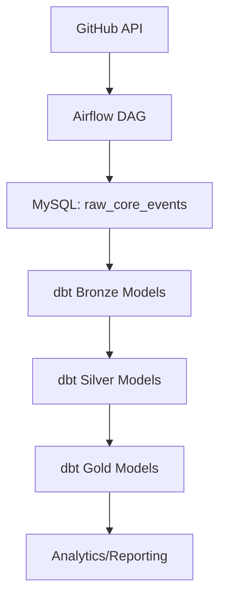

# GitHub Event Analysis Project

This project analyzes GitHub event data using a modern data stack. It leverages Airflow for orchestration, MySQL for storage, and dbt for data transformation and analytics.

## Project Structure

- **dags/**: Contains Airflow DAGs for data ingestion and warehouse loading.
- **dbt/github_event_analysis/**: dbt project for transforming and modeling GitHub event data.
- **docker-compose.yaml**: Orchestrates services (Airflow, MySQL, etc.) using Docker Compose.
- **requirements.txt**: Python dependencies for the project.

## Getting Started

### Prerequisites
- Docker & Docker Compose
- Python 3.8+

### Setup
1. Clone the repository in local.
2. Start services:
   ```sh
   docker-compose up --build
   ```
3. Access Airflow UI at [http://localhost:8080](http://localhost:8080)
4. Access MySQL at [localhost:3306](localhost:3306)
5. create MYSQL database and user for storing DWH.Here I used Database: github_event_analysis with user: samboy_88:awesome_person

### dbt Usage
1. Open docker 
   ```docker exec -it airflow_webserver bash```

2. Navigate to the dbt project directory:
   ```cd dbt/github_event_analysis```
2. Install dependencies:
   ```dbt deps```
3. Run dbt models:
   ```dbt run```
4. compiling Models:
   ```dbt compile```
5. Debugging issues:
   ```dbt debug```
6. Test models:
   ```dbt test```

## Folder Details
- **dags/**
  This folder contains all configuration of Airflow DAGs.As of this has 2 DAGs configured
  - **raw_ingestion_dag/**: Raw data ingestion DAGs.
    This DAG extracts raw data and loads into Bronze layer of the DWH. It automates the extraction of multiple event types from a specified GitHub repository and stores them in bronze layer.
  - **dwh_load**: Data warehouse loading DAGs.
    This folder contains Airflow DAGs and scripts responsible for loading data into the Data Warehouse (DWH).

- **dbt/github_event_analysis/models/**: dbt models (bronze, silver, gold layers).


## Database Model
The dbt project builds structured tables from raw GitHub event data. Typical layers:

### `dim_event_type`
Dimension table describing event types, used for analysis and reporting.

### `dim_pull_request`
Dimension table describing event types, used for analysis and reporting.

### `dim_repo`
Dimension table describing event types, used for analysis and reporting.

### `dim_user`
Dimension table describing event types, used for analysis and reporting.

### `fact_pull_request_event`
Dimension table describing event types, used for analysis and reporting.


## Dataflow Architecture



- **A:** Data is fetched from GitHub API.
- **B:** Airflow orchestrates ingestion into MySQL.
- **C:** Raw data stored in `raw_core_events`.
- **D:** dbt bronze models stage raw data.
- **E:** dbt silver models clean and transform.
- **F:** dbt gold models provide analytics-ready tables.
- **G:** Data is used for dashboards, reports, and insights.

