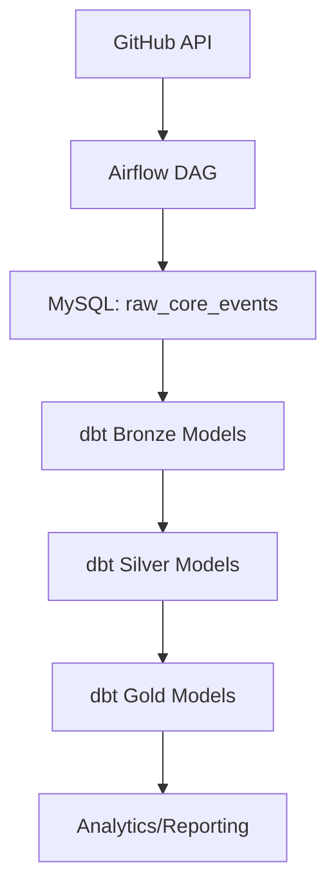

# GitHub Event Analysis dbt Project

This dbt project transforms and models GitHub event data for analytics and reporting. It is part of a larger data pipeline that ingests raw events, processes them, and delivers structured insights.

## Structure
- **dbt_project.yml**: Main dbt project configuration.
- **profiles.yml**: Database connection settings.
- **models/**: Contains dbt models organized by layer:
  - **bronze/**: Raw staging models.
  - **silver/**: Cleaned and transformed models.
  - **gold/**: Final analytics-ready models (dimensions, facts).
- **analyses/**: SQL analysis scripts.
- **seeds/**: Seed data for dbt.
- **snapshots/**: Slowly changing dimension snapshots.
- **tests/**: dbt tests for data quality.
- **macros/**: Custom dbt macros.
- **logs/**: dbt run logs.

## Usage
1. Install dbt and dependencies:
	```sh
	dbt deps
	```
2. Run transformations:
	```sh
	dbt run
	```
3. Test models:
	```sh
	dbt test
	```
4. Analyze data:
	```sh
	dbt compile
	dbt docs generate
	dbt docs serve
	```

## Database Model
The dbt project builds structured tables from raw GitHub event data. Typical layers:

| Layer   | Purpose                        | Example Models           |
|---------|-------------------------------|-------------------------|
| Bronze  | Raw staging from source        | raw_core_events         |
| Silver  | Cleaned, transformed           | event_type, repo_stats  |
| Gold    | Analytics-ready (facts/dims)   | dim_event_type, fct_events |

### Example Gold Model: `dim_event_type`
Dimension table describing event types, used for analysis and reporting.

## Dataflow Architecture



- **A:** Data is fetched from GitHub API.
- **B:** Airflow orchestrates ingestion into MySQL.
- **C:** Raw data stored in `raw_core_events`.
- **D:** dbt bronze models stage raw data.
- **E:** dbt silver models clean and transform.
- **F:** dbt gold models provide analytics-ready tables.
- **G:** Data is used for dashboards, reports, and insights.

## Best Practices
- Use version control for dbt models and configs.
- Test models regularly with `dbt test`.
- Document models for clarity.
- Monitor dbt run logs for errors.

## Resources
- [dbt Documentation](https://docs.getdbt.com/docs/introduction)
- [dbt Discourse](https://discourse.getdbt.com/)
- [dbt Community Slack](https://community.getdbt.com/)
- [dbt Events](https://events.getdbt.com)
- [dbt Blog](https://blog.getdbt.com/)
